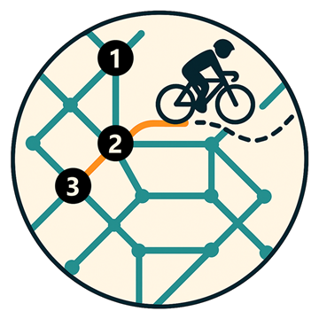
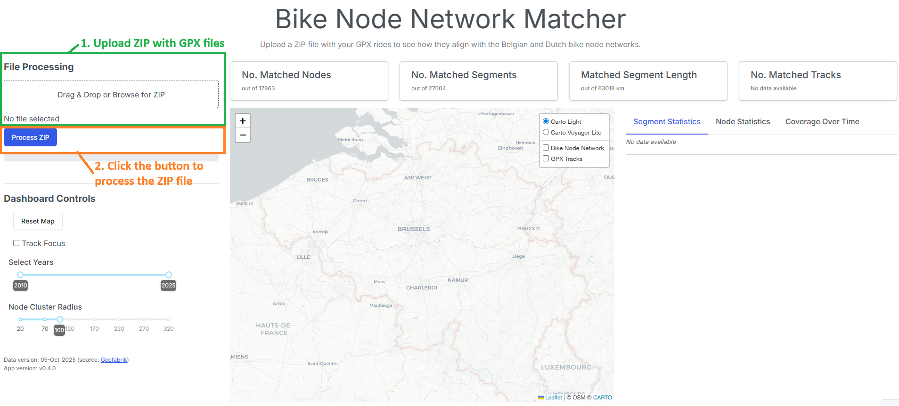
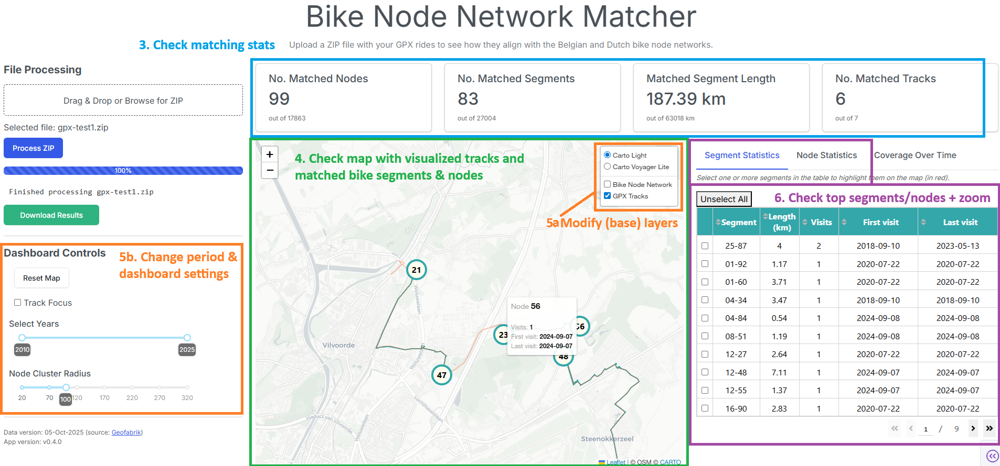
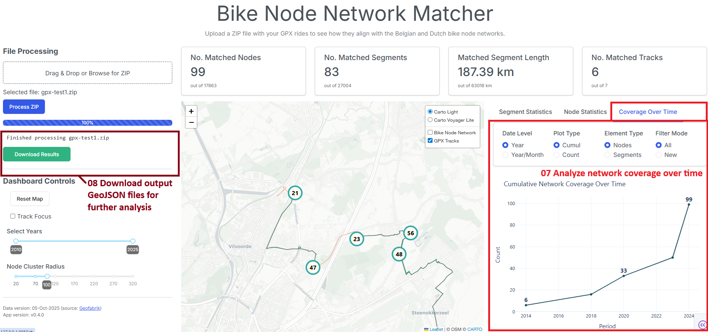
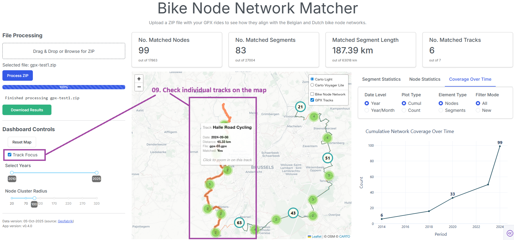

# Bike Node Network Matcher 🚲


<p align="center">
  <br>
</p>

A Dash app to explore how your GPX rides align with the Belgian and Dutch bike node networks.

Upload a ZIP of your rides (these can be exports from Garmin Connect, Strava, 
files from an old Garmin device collecting dust, etc.), see matched nodes and segments on 
an interactive map, and download the results.

---

## Demo

A live demo of the app is available on Render:

🔗 **https://gpx-bike-node-matcher.onrender.com**

To try it out:

1. Select one of the **sample ZIP files** from the default tab, or switch to the **Upload Your Own ZIP** tab to use your own GPX rides. 
2. Click **Process ZIP** to match them against the bike node network.  
3. Explore the results in the dashboard and on the interactive map.  
4. Download the processed outputs as a ZIP file when finished.

>⚠️ **Note**: This hosted demo is intended for **testing and exploration only**. It does not include authentication or full security measures, so please **avoid uploading sensitive data** such as GPX rides that may reveal private locations.

The hosted version currently includes **only the Belgian bike node network and uses lighter track-matching settings** due to memory limits on the free Render tier. Performance may be slower for larger uploads 🐢. For full coverage (including the Netherlands and cross-border regions) or faster processing, please run the app locally.

---

## App Overview

> ⚠️ **Note**: The screenshots below are based on an earlier version of the app, but the overall layout and functionality remain representative of the current version.


### Upload and process GPX files

- Select one of the sample files or upload a ZIP file containing one or more GPX files (each GPX can include multiple tracks, *item 1 on the screenshot*)

- Click **Process ZIP** to match your GPX tracks against the bike node network (*item 2 on the screenshot*).



### Analyze the matching results

- Explore aggregated statistics for matched **nodes, segments, tracks, and segment lengths** *(item 3 on the screenshot)*.
- Visualize matched bike nodes and segments on an interactive map *(item 4 on the map)*. At lower zoom levels, nodes are clustered for a cleaner view.
- Optionally switch the **basemap** or toggle **track** and **bike node network** layers *(item 5a on the screenshot)*.
- Adjust map and data display using dashboard controls to reset the map view, filter results by period, or fine-tune node clustering (*item 5b on the screenshot*).
- Focus on top-matched nodes or segments with quick zoom controls *(item 6 on the screenshot)*.



### Track network coverage over time & download results

- View how matched nodes and segments accumulate over time on an interactive chart *(item 7 in the screenshot)*.
- Download processed results as a ZIP file containing the output GeoJSON layers *(item 8 in the screenshot)*.



### Inspect individual tracks

- Zoom into individual tracks by activating the **Track Focus** option in the dashboard controls, and compare them with their matched nodes and segments on the map *(item 9 in the screenshot)*.



---

## Data

The underlying bike network data come from [Geofabrik OSM extracts](https://download.geofabrik.de/europe.html).

---

## QGIS Web Map & Geoprocessing Flow

A simplified, interactive **QGIS web map** showing the key input layers and the main steps of the matching process is available here:

🔗 **https://roemeren.github.io/gpx-bike-node-matcher/**

For a full explanation of the underlying **QGIS geoprocessing workflow**, including all intermediate layers, see the [accompanying wiki page](https://github.com/roemeren/gpx-bike-node-matcher/wiki/QGIS-Geoprocessing-Demo):

You can also find the complete original QGIS project — together with example inputs, intermediate files, and final outputs — under:

`examples/qgis_demo/`

---

## Running Locally

### Step 1: Clone the repo

```bash
git clone <repo_url>
cd <repo_name>
```
### Step 2: Create a Python 3.12 environment and install dependencies

```bash
python3.12 -m venv venv
source venv/bin/activate  # or venv\Scripts\activate on Windows
pip install -r requirements.txt
```
### Step 3: Run the app

```bash
python -m app.dash_app
```

### Step 4: Open the app in your browser

Open http://127.0.0.1:8050 in your browser

**Warning:** large GPX ZIPs can take a while. Patience is a virtue. ⏳

## Project Structure (Highlights)

- `app/` - Dash app code
- `data/processed/` - Preprocessed bike network data (GeoJSON + parquet)
- `core/` - Helper functions and source file geoprocessing logic
- `.github/workflows/` - GitHub Actions for  
  - automating **Geofabrik data processing**  
  - deploying the app to **Render**

---

## Notes

### Data Updates

The app relies on preprocessed data stored in `data/processed/`, which is automatically refreshed through a GitHub Actions workflow.  

For details on how the underlying Geofabrik extracts are downloaded, processed, and how to update them manually (e.g., with **osmium** and **GDAL**), see the [Data Update Guide](https://github.com/roemeren/gpx-bike-node-matcher/wiki/Data-Update-Guide) in the project wiki.

### Documentation & Wiki

For more details on:
- understanding the **general project architecture**,
- how sample GPX data is generated using OpenRouteService,
- or various technical deep dives on background processing, track matching and more,

visit the [📘 Project Wiki](https://github.com/roemeren/gpx-bike-node-matcher/wiki).